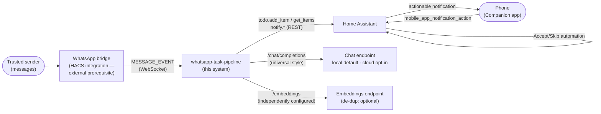

# 3. Context & scope

The pipeline sits between a message source and a phone, with Home Assistant as
the hub for events, task storage, and notifications. AI endpoints are anything
speaking the OpenAI-style format — local by default (Ollama, LM Studio,
llama.cpp), cloud only by explicit opt-in (DECISIONS.md D-0002).

## In scope (this repository)

- Classification, confidence routing, semantic de-duplication
  (`src/whatsapp_task_pipeline/task_extract.py`)
- The provider layer: universal AI style + cloud guardrail
  (`src/whatsapp_task_pipeline/providers.py`)
- Reminder cadence over open items (`task_reminders.py`)
- Reference listener: WebSocket subscription + debounce + handler fan-out
  (`listener.py`)
- Setup validation (`check.py` — the `wtp-check` command)
- The Accept/Skip automation (`homeassistant/`), packaging (`pyproject.toml`),
  container setup (`Dockerfile`, `docker-compose.yml`), launchd template
  (`deploy/`)

## Out of scope (external systems)

- The WhatsApp bridge integration (HACS-distributed, user-installed —
  e.g. FaserF/ha-whatsapp; DECISIONS.md D-0013). This tool only subscribes to
  the event it fires.
- Home Assistant, its `todo` storage, and the Companion app
- The AI servers themselves (Ollama or any OpenAI-style endpoint)
