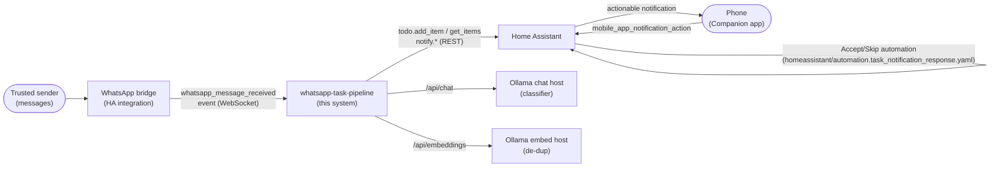

# 3. Context & scope

The pipeline sits between a message source and a phone, with Home Assistant as
the hub for events, task storage, and notifications, and Ollama hosts providing
the two model capabilities.

## In scope (this repository)

- Classification, confidence routing, semantic de-duplication
  (`src/task_extract.py`)
- Reminder cadence over open items (`src/task_reminders.py`)
- Reference listener: WebSocket subscription + debounce + handler fan-out
  (`src/listener_example.py`)
- The Accept/Skip routing automation (`homeassistant/`) and a launchd template
  (`deploy/`)

## Out of scope (external systems)

- The WhatsApp bridge itself (any integration emitting the event works —
  README.md § Requirements)
- Home Assistant, its `todo` storage, and the Companion app
- The Ollama hosts and the models they serve
