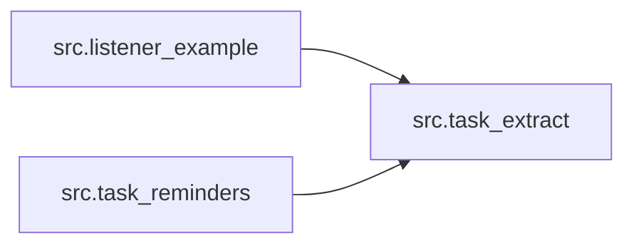

# 5. Building blocks

Structure below mirrors the extracted IR
([generated/architecture-ir.json](generated/architecture-ir.json)); the import
graph is correct by construction
([generated/dependency-graph.md](generated/dependency-graph.md)).

## Component inventory

- `src.task_extract` — classifier + router + de-dup core; exposes
  `handle_message(combined_text, sender_number)`, owns all HA REST writes
  (`_add_todo`, `_send_actionable`) and the Ollama calls (`_classify`,
  `_embed`). [why: docs/ARCHITECTURE.md § "Classification" — the smallest-job
  principle; no DECISIONS entry yet, log begins at adoption]
- `src.task_reminders` — reminder loop over open to-do items; owns only timing
  metadata in a sidecar JSON (`_load_state`/`_save_state`), self-gates to
  waking hours. [why: docs/ARCHITECTURE.md § "The reminder loop"; no DECISIONS
  entry yet, log begins at adoption]
- `src.listener_example` — reference front door: HA WebSocket subscription,
  reconnect loop, per-sender debounce (`_debounce`, `_flush_debounced`),
  handler fan-out. [why: docs/ARCHITECTURE.md § "One front door, N services";
  no DECISIONS entry yet, log begins at adoption]

## Component graph

Both edges are top-level imports: the listener imports `handle_message`
(`src/listener_example.py:32`), and the reminder loop reuses
`_load_trusted_senders` and `_get_open_todos` (`src/task_reminders.py:35`) so
the trusted-sender map and the HA fetch logic have exactly one home.

Non-code building blocks (not modules, so not in the IR):
`homeassistant/automation.task_notification_response.yaml` (Accept/Skip
routing inside HA) and `deploy/com.example.task-reminders.plist` (launchd
schedule template).
