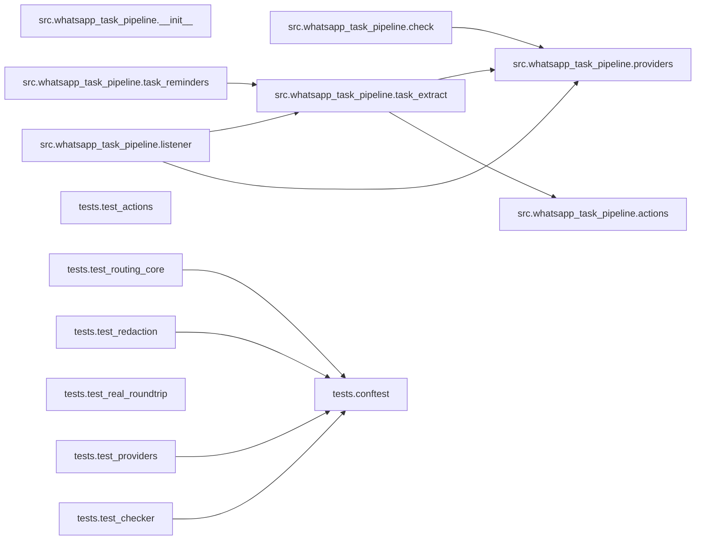

# 5. Building blocks

Structure below mirrors the extracted IR
([generated/architecture-ir.json](generated/architecture-ir.json)); the import
graph is correct by construction
([generated/dependency-graph.md](generated/dependency-graph.md)).

## Component inventory

- `src.whatsapp_task_pipeline.task_extract` — classifier + router + de-dup
  core; exposes `handle_message(combined_text, sender_number)`, owns all HA
  REST writes (`_add_todo`, `_send_actionable`) and the redaction helper
  (`_redact`). [why: DECISIONS.md D-0010 — one universal AI path; docs/ARCHITECTURE.md § "Classification"]
- `src.whatsapp_task_pipeline.providers` — the provider layer: OpenAI-style
  `chat()` and `embed()` against any configured endpoint, the
  local/non-local boundary (`is_local_endpoint`), and the cloud guardrail
  (`enforce_startup_policy`, `outbound_sender_name`). [why: DECISIONS.md
  D-0010 (universal style), D-0002 (Option A guardrail), D-0014 (boundary
  encoding)]
- `src.whatsapp_task_pipeline.task_reminders` — reminder loop over open
  to-do items; owns only timing metadata in an atomically-written sidecar
  JSON; self-gates to waking hours. [why: docs/ARCHITECTURE.md § "The
  reminder loop"]
- `src.whatsapp_task_pipeline.listener` — reference front door: HA WebSocket
  subscription (event name configurable via `MESSAGE_EVENT`), reconnect
  loop, per-sender debounce, handler fan-out; enforces the cloud guardrail
  at startup. [why: docs/ARCHITECTURE.md § "One front door, N services";
  DECISIONS.md D-0013 (configurable event)]
- `src.whatsapp_task_pipeline.actions` — tool-side Accept/Skip: the
  tid-keyed pending store (staged at send, popped before add, TTL-pruned,
  atomic writes) and the injectable action resolver. [why: DECISIONS.md
  D-0018 — the Android Companion app drops custom notification payload, so
  only the action string round-trips]
- `src.whatsapp_task_pipeline.check` — the `wtp-check` command: validates a
  whole setup with a green/red line per check, plain-language reasons,
  secrets reported by validity only. [why: DECISIONS.md D-0004 (catch-list),
  D-0011 (config approach)]
- `src.whatsapp_task_pipeline.__init__` — package marker + version.
  [why: DECISIONS.md D-0012 — package layout]
- `tests.conftest` — shared fixtures: the fake network seam (`FakeNetwork`)
  patched over both requests boundaries. [why: D-0008 — the test bar's
  "mock external only" discipline]
- `tests.test_routing_core` — the frozen-behavior baseline (gate, routing,
  de-dup threshold both sides, fail-open paths). [why: adoption finding F-1;
  D-0008]
- `tests.test_providers` — request shapes, the 19-case local-boundary truth
  table, guardrail unit proofs. [why: D-0010, D-0002]
- `tests.test_checker` — the checker catch-list matrix against deliberately
  broken configs. [why: D-0004]
- `tests.test_actions` — the pending store: accept / skip / idempotent
  second tap / unknown action / expiry / persistence. [why: D-0018]
- `tests.test_redaction` — default log holds no message content; verbose
  restores it. [why: D-0005 — redacted-by-default logging]
- `tests.test_real_roundtrip` — the make-or-break suite against REAL Ollama
  (gated by `WTP_REAL_TESTS=1`): round-trip, passthrough-on-the-wire,
  zero-non-local-calls, name-stripping. [why: INC-001 KH-1/KH-2 — a mock
  hides exactly the dialect risks]

## Component graph

`providers` is the fan-in point for all AI traffic (three importers) — the
single seam where the universal request style and the cloud guardrail live,
so no other module can talk to a model or leak past the policy.

Accept/Skip on the actionable notifications is handled by `actions` (a
pending store keyed by task id, resolved from the `mobile_app_notification_action`
event by the listener) — not by a Home Assistant automation, because the Android
Companion app drops custom notification payload on that event. See ARCHITECTURE.md,
"Accept/Skip".

Non-code building blocks (not modules, so not in the IR):
`deploy/com.example.task-reminders.plist` (launchd schedule template),
`Dockerfile` + `docker-compose.yml` (the containerised run), and
`pyproject.toml` (packaging + the three `wtp-*` console commands).
