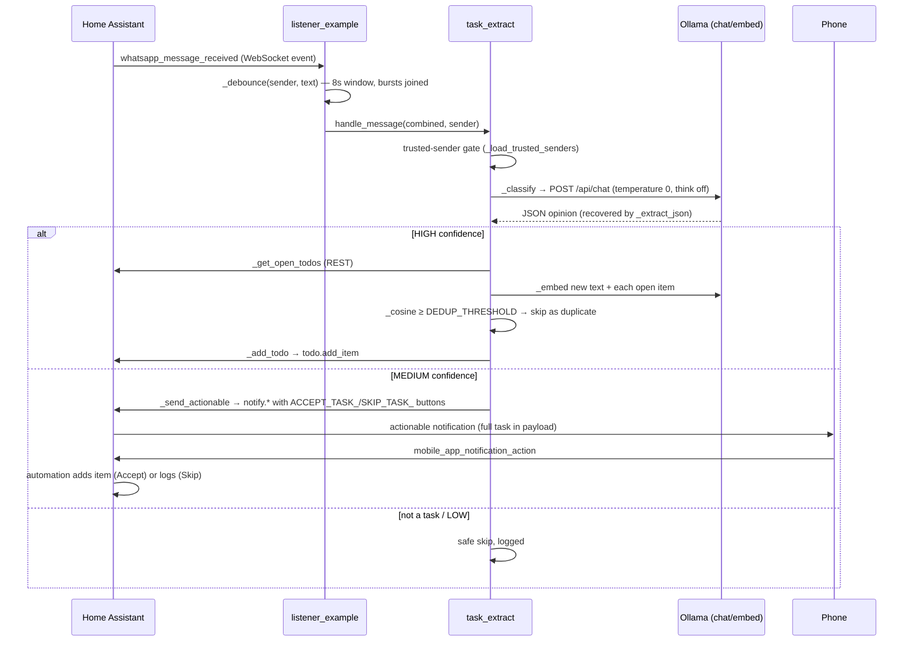
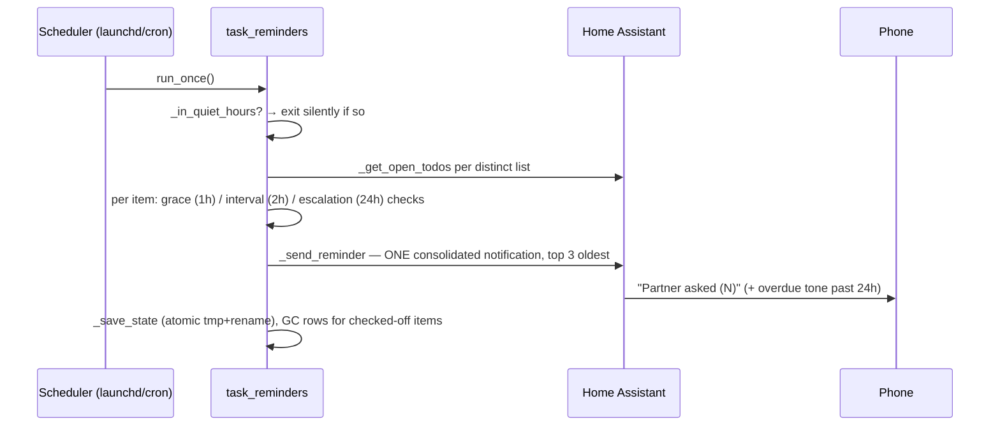

# 6. Runtime view

Two flows, grounded in the extracted call/import structure and the real
function names.

## The life of a message

## The reminder cycle (every ~30 min via scheduler)

Checking the item off in Home Assistant is the only dismiss — the next cycle
garbage-collects its timing row (docs/ARCHITECTURE.md § "The reminder loop").
