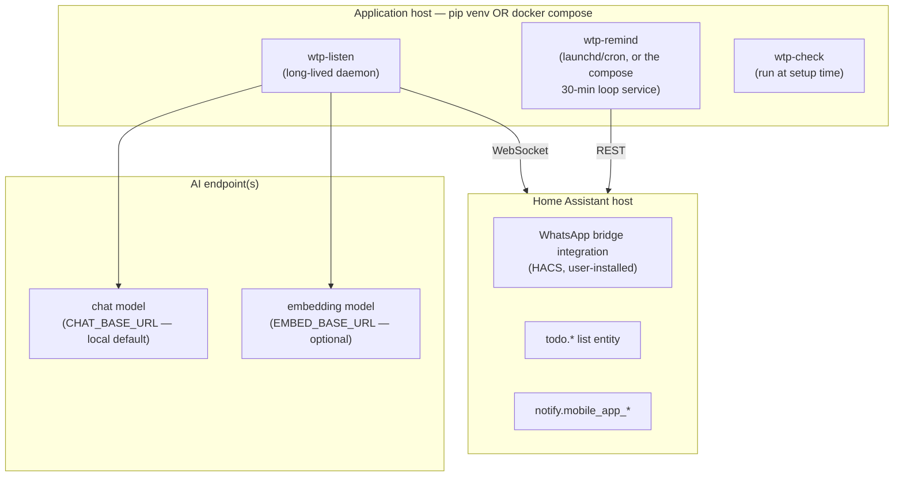

# 7. Deployment view

Three roles; originally three machines, equally valid as one
(docs/ARCHITECTURE.md § Topology). Two supported run shapes since INC-001.

- **pip shape:** `pip install .` yields the three `wtp-*` commands
  (DECISIONS.md D-0012); `wtp-listen` runs supervised; `wtp-remind` fires
  every 30 min from `deploy/com.example.task-reminders.plist` (macOS) or a
  cron/systemd timer.
- **Docker shape:** `docker compose up -d` runs `listener` and `reminders`
  services from one image (D-0006); Home Assistant and the AI server stay
  outside; an optional commented CPU-only Ollama block exists in the compose
  file. In-container address caveats are documented at the top of
  `docker-compose.yml` (`host.docker.internal`).
- Both AI endpoints are configured independently and may live anywhere the
  guardrail permits: local by default, non-local only with the
  `ACCEPT_CLOUD_TEXT` acknowledgment (D-0002).
- Secrets (`HA_TOKEN`, and `CHAT_API_KEY`/`EMBED_API_KEY` when a provider
  needs one) arrive via the local `.env` only — gitignored, docker-ignored,
  never logged (D-0011).
