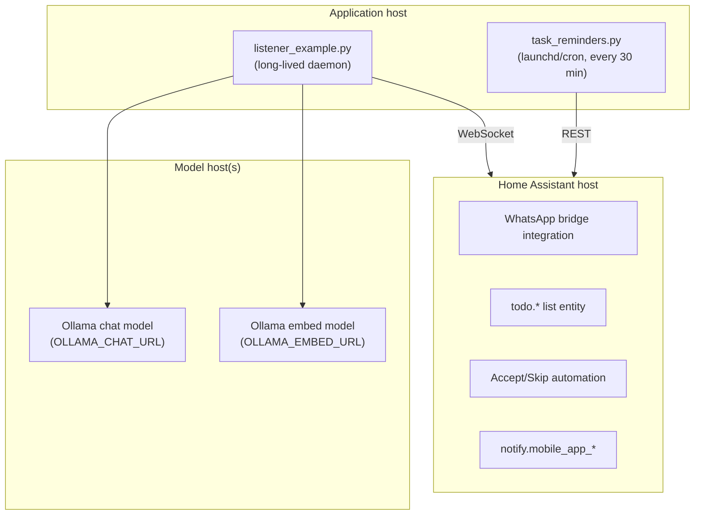

# 7. Deployment view

Three roles; originally three machines, equally valid as one
(docs/ARCHITECTURE.md § Topology).

- The listener runs as a supervised daemon (any supervisor; reconnect loop is
  built in). The reminder script is fired unconditionally by a scheduler and
  self-gates to waking hours — `deploy/com.example.task-reminders.plist` is
  the macOS template, with `RunAtLoad=false` so a reboot can't fire a 3 a.m.
  nudge (comment in the plist itself).
- Chat and embedding endpoints are configured separately because a chat-only
  Ollama host 404s `/api/embeddings` — a silent failure otherwise
  (comment at `src/task_extract.py:42`).
- Secrets: `HA_TOKEN` arrives via the environment (`.env`, gitignored); the
  repo ships only `.env.example` placeholders.
