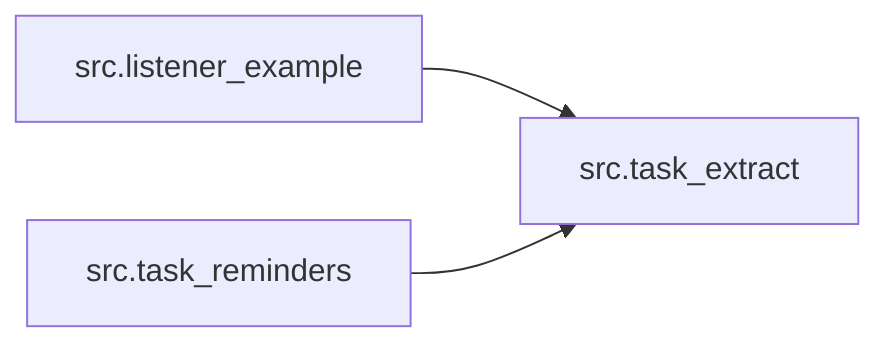

<!-- generated by /friday:reference (tools/doc-synthesis/extract_architecture.py) — do not hand-edit; regenerated on commit -->

# Dependency graph (generated)

Intra-tree import graph — **3 modules, 2 import edges**. Every edge is a literal `import` statement in the source; the C4 Component level, correct-by-construction.

## Fan-in / fan-out

| Module | Imports (out) | Imported by (in) |
| --- | ---: | ---: |
| `src.listener_example` | 1 | 0 |
| `src.task_extract` | 0 | 2 |
| `src.task_reminders` | 1 | 0 |

