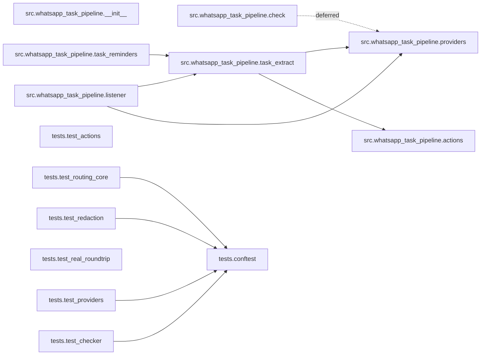

<!-- generated by /friday:reference (tools/doc-synthesis/extract_architecture.py) — do not hand-edit; regenerated on commit -->

# Dependency graph (generated)

Intra-tree import graph — **14 modules, 10 import edges**. Every edge is a literal `import` statement in the source; the C4 Component level, correct-by-construction.

## Fan-in / fan-out

| Module | Imports (out) | Imported by (in) |
| --- | ---: | ---: |
| `src.whatsapp_task_pipeline.__init__` | 0 | 0 |
| `src.whatsapp_task_pipeline.actions` | 0 | 1 |
| `src.whatsapp_task_pipeline.check` | 1 | 0 |
| `src.whatsapp_task_pipeline.listener` | 2 | 0 |
| `src.whatsapp_task_pipeline.providers` | 0 | 3 |
| `src.whatsapp_task_pipeline.task_extract` | 2 | 2 |
| `src.whatsapp_task_pipeline.task_reminders` | 1 | 0 |
| `tests.conftest` | 0 | 4 |
| `tests.test_actions` | 0 | 0 |
| `tests.test_checker` | 1 | 0 |
| `tests.test_providers` | 1 | 0 |
| `tests.test_real_roundtrip` | 0 | 0 |
| `tests.test_redaction` | 1 | 0 |
| `tests.test_routing_core` | 1 | 0 |

